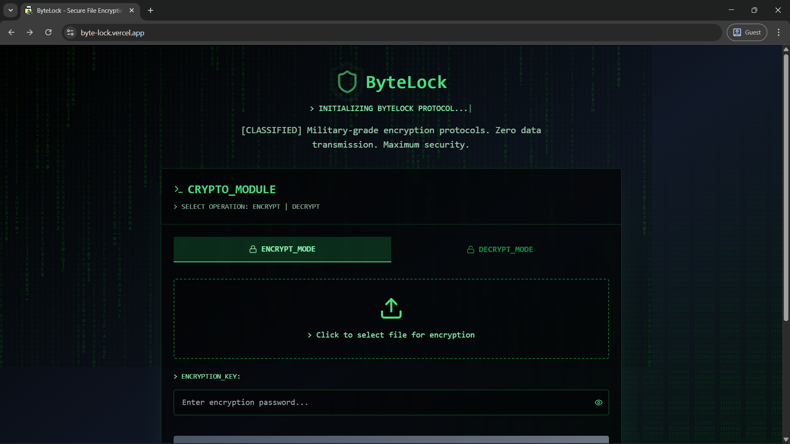

# ByteLock

**Military-Grade File Encryption • Client-Side Only • Zero Data Transmission**

## Live Demo

**[https://byte-lock.vercel.app](https://byte-lock.vercel.app)**

## Overview

**ByteLock is a fully client-side file encryption system that executes all cryptographic operations locally within the user’s browser environment. Utilizing AES-256 in GCM mode, ByteLock ensures confidentiality and integrity without transmitting or storing any file data on external servers. The application follows a zero-knowledge design which means encryption keys are generated, used, and disposed of entirely in-memory on the client side. ByteLock provides robust, verifiable security while maintaining complete local data control.**

### Key Features

- **Military-Grade Encryption**: AES-256 encryption algorithm
- **100% Client-Side**: All encryption happens in your browser - zero server uploads
- **Multiple File Support**: Encrypt multiple files at once with automatic ZIP packaging
- **Drag & Drop**: Intuitive drag-and-drop interface with file reordering
- **Smart File Icons**: Automatic file type detection with color-coded icons
- **Large File Support**: Handle files up to 1GB (5GB total)
- **Real-Time Progress**: Live encryption/decryption progress tracking
- **Password Strength Meter**: Real-time password validation and strength indicator
- **Batch Operations**: Remove all files at once or individually

## Tech Stack

- **Framework**: [Next.js 15.2](https://nextjs.org/) (React 19)
- **Language**: [TypeScript 5](https://www.typescriptlang.org/)
- **Styling**: [Tailwind CSS](https://tailwindcss.com/) + [Tailwind Animate](https://github.com/jamiebuilds/tailwindcss-animate)
- **UI Components**: [Radix UI](https://www.radix-ui.com/)
- **Icons**: [Lucide React](https://lucide.dev/)
- **File Compression**: [JSZip](https://stuk.github.io/jszip/)
- **Encryption**: Web Crypto API(Local in-browser) (AES-256-GCM)
- **Deployment**: [Vercel](https://vercel.com/)

## Security Features

- **AES-256-GCM Encryption**: Industry-standard encryption algorithm
- **Client-Side Processing**: Files never leave your browser
- **Zero Data Transmission**: No server uploads or cloud storage
- **Password-Based Key Derivation**: PBKDF2 with 100,000 iterations
- **Secure Random Salt**: Unique salt for each encryption
- **Authentication Tags**: Ensures data integrity and authenticity

## Features in Detail

### File Type Detection
ByteLock automatically detects and displays appropriate icons for:
- Documents (PDF, DOC, TXT)
- Images (JPG, PNG, GIF, SVG)
- Videos (MP4, AVI, MOV)
- Audio (MP3, WAV, FLAC)
- Archives (ZIP, RAR, 7Z)
- Code Files (JS, TS, PY, etc.)
- Spreadsheets (XLS, CSV)

### Password Validation
- Minimum 8 characters required
- Real-time strength indicator (Weak/Medium/Strong)
- Visual feedback with color-coded progress bar
- Automatic validation before encryption

### Error Handling
- Detailed error messages for incorrect passwords
- File corruption detection
- File size validation (1GB per file, 5GB total)
- User-friendly suggestions for common issues

## License

This project is licensed under the MIT License - see the [LICENSE](LICENSE) file for details.

